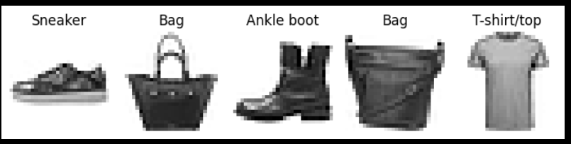
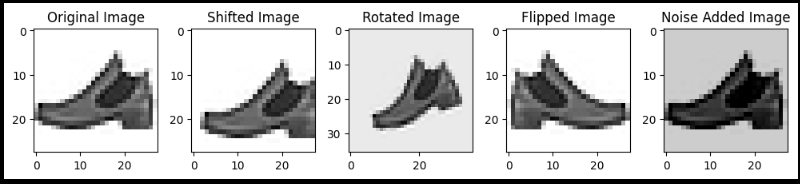
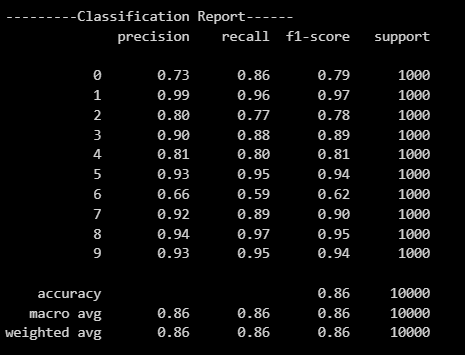
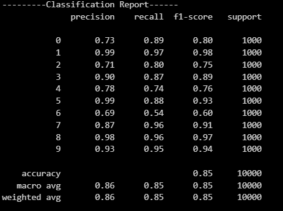
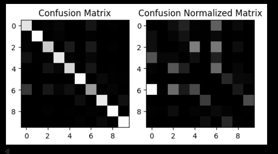
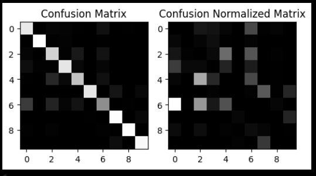
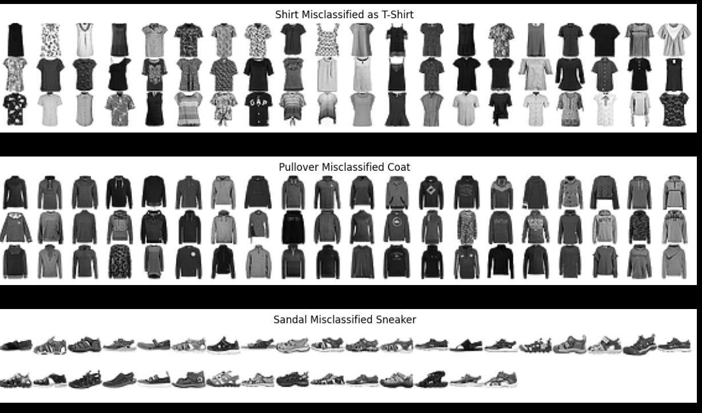

# Data Augmentation on Fashion MNIST Classification
# Overview 
This project aims to examine the effect of `Data Augmentation` on performance Classifier Models. The benchmark for measuring accuray is `Fashion MNIST`.

# Dataset
- Source: [Fashion MNIST - Zalando Research (Kaggle)] URL: https://www.kaggle.com/datasets/zalando-research/fashionmnist

- Size: 70,000 images of clothes and accessories

- Type: images are stored as 1 x 784 vectors

- LabelFeatures: 
    * Number 0: T-shirt/top
    * Number 1: Trouser
    * Number 2: Pullover
    * Number 3: Dress
    * Number 4: Coat
    * Number 5: Sandal
    * Number 6: Shirt
    * Number 7: Sneaker
    * Number 8: Bag
    * Number 9: Ankle boot

# Train - Test set
The dataset was splitted into: 
- Train: 60,000 images
- Test: 10,000 images

Some instances of the dataset:

# Data Preprocessing
Framework: 
- Standardization: StandardScaler (scikit-learn)
- Data Augmentation: 
    * Shift in 4 directions (left, right, up, down) by 2 pixels
    * Rotate in 4 angles (-20, -10, 10, 20) in degrees
    * Flip vertically
    * Add Noise (Blacken) 
    * Load to .npz files for future use

*As there are 10 augmenting movements in total, the size of training set was expanded by 11 time. Some instances demonstrating Data Augmentation:*

# Fine-Tuning
**KNeighborsClassifier** and **RandomForestClassifer** were chosen for benchmark.

## Cross Validation: 
- Cross Validating subset: 10,000 instances from *scaled* training set
- Instances are selected using `Stratified Sampling`
- Number of CV: 3 groups

## Hyper Parameter Tuning: 
- Framework: `Optuna`
- Refit tuned models on *augmented and scaled* training set
- Refitted models are stored locally as `.pkl` files

## Performance
|Model\Accuracy| Before **Data Augmentation** | After **Data Augmentnation**|
|:---:|:---:|:---:|
|Random Forest|~86.28%|~86.34%|
|KNN|~82.85%|~83.68%|

# Validate on Test set
### Random Forest Accuracy: 86%

### KNN Accuracy: 85%

# Error Analysis
### Random Forest

### KNN

**For both models, the prominent errors are pretty reasonable**: 